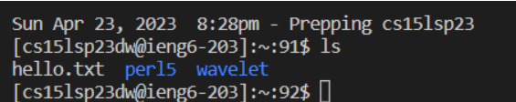
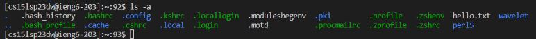
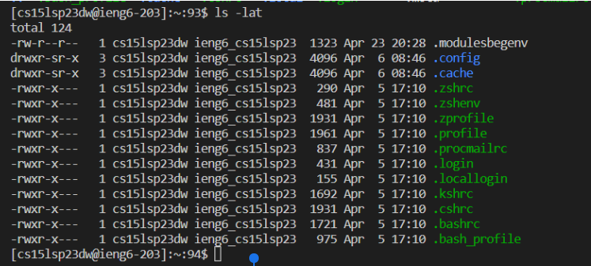
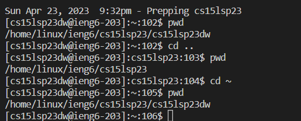

# Getting Started
## Visual Studio Code
Hello! And welcome to the course! First, we if you plan to use your personal computer or laptop for this course we must ensure you have the proper set up. (For those who plan to use the lab's computers, you can skip the set up!)

### Step one
Install [Visual Studio Code](https://code.visualstudio.com/) to your personal device, there are instructions on the site to which you can follow for help when installing.

After installing, you should end up with a screen such as this

For me, I had downloaded VSCode through the website first.
Next, I set up the program as desired.

## Remote Connection
### Step two
Another installation! Here we are going to start accessing our course-specific account, for this (if you do not have it already) you will need to install something called `git`. For this you will need to download it here [git](https://gitforwindows.org/)

After you've installed git onto your device you will set git-bash as your default terminal setting, as so:

1. First start by opening up your terminal in VSCode
2. Now open your command palette
3. From there type 'Select Default Profile' then select Git from those options
4. Now when you look in the terminal where it reads 'powershell' there should be an option for 'bash' as well in the dropdown
5. You're all set up with git!

Once all that is done, open up a new terminal (ensuring that it is bash), in the terminal type:
`ssh cs15lsp23--@ieng6.ucsd.edu`
in which the '--' pieces are replaced with the unique two letters for your course-specific account.

If you are unsure of what your course-specific account is you can go to this website:
[Course-Specific Account](https://sdacs.ucsd.edu/~icc/index.php)

From here, you will receive a message from the server as it is the first time you have connected. The ending message should read:
`Are you sure you want to continue connecting (yes/no/[fingerprint])?`
You will type 'yes' so as to log in, from here another message will appear:
`Password: `
Input your course-specific password. (It is important to note that as you type the characters will not appear within the terminal visibly, however these characters are still being inputted)

Once logged in, you will receive this message:

Here as explained I had input the command `ssh cs15lsp23--@ieng8.ucsd.edu` (of course using my own two letters for my account in place of the '--')
Then I had input my password as asked!

## Commands
### Step Three
Great! You're all logged in, now let's use some of the concepts we've learned/ heard about in class here in our own terminal

Here is a list of some commands you can try:
List commands here:
* cd
* cd ..
* cd ~
* ls
* ls -a
* ls -lat
* pwd
* cat

Below is an example of some of these commands in action:

**ls**

Here is the ls command in action! What this does is simply list all the directories in which you are currently working in!

**ls -a**

Here is the result of using the ls -a! What this command does is list out all the directories at which are available to be accessed and used.

**ls -lat**

Here is ls -lat! This command not only lists out all the available directories but also the last time at which they are accessed by users on the server and the number of users too!

**cd ..  and cd ~ and pwd**

Here is both the cd .. , cd ~ , and pwd commands at work. As you can see I first use the pwd command which prints out the current path and working directory that you are in. Next I use the cd .. command which takes you a folder closer towards the parent directory, which you can see when we use the pwd command it prints the new working directory. Now if we use the cd ~ command, it brings us to the folder or file forward, using the pwd we can see we are now back at the original directory we started in!

# Completed!
## And congrats you've just completed your remote connection and login, play around with the commands some more! Have fun!
