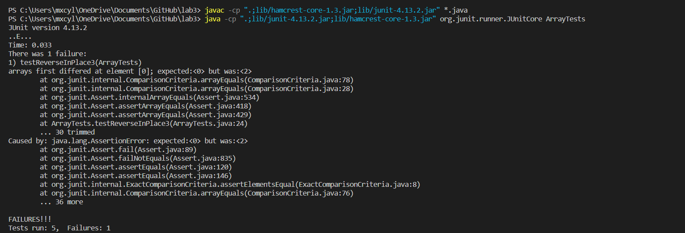

# Part 1

# Part 2

## A failure-inducing input
@Test  
public void testReverseInPlace2(){  
|    int[] input2 = {1,2};  
|    int[] expected2 = {2,1};  
|    assertArrayEquals(ArrayExamples.reversed(input2), expected2);  
 }  

## An input that does not produce a failure
@Test  
public void testReverseInPlace2(){  
|    int[] input2 = {1,2,3,4};  
|    ArrayExamples.reverseInPlace(input2);  
|    assertArrayEquals(new int[]{4,3,2,1}, input2);  
}

## The symptom as an output running of the tests

## The bug
### BEFORE CHANGE
static int[] reversed(int[] arr) {  
|    int[] newArray = new int[arr.length];
|    for(int i = 0; i < arr.length; i += 1) {  
|        arr[i] = newArray[arr.length - i - 1];  
|    }  
|    return arr;  
}
### AFTER CHANGE

static int[] reversed(int[] arr) {  
|    int[] newArray = new int[arr.length];  
|    for(int i = 0; i < arr.length; i += 1) {  
|        newArray[i] = arr[arr.length - i -1];  
|    }  
|    return newArray;  
}

  

# Part 3
Something I had learned from week 2 was about the structure of a URL and the breakdown of each component. I learned the correct terminology for all parts of the URL. Previously I had only known about the domain of a URL, after week 2 I learned about the protocol, path/part, query, and anchor/fragment.
