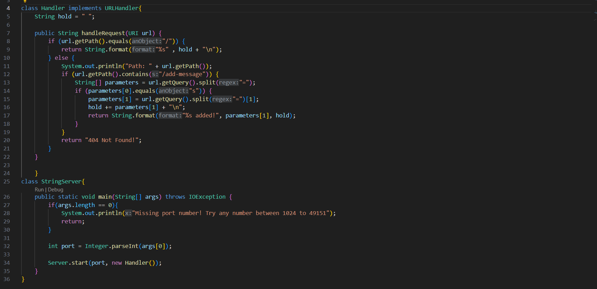
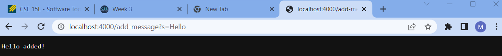
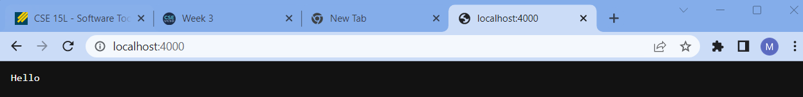
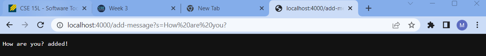
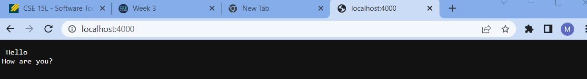

# Part 1
## My code for StringServer


## First example of using the /add-message


## Output of first example of using the /add-message


The methods in my code that are being called are the handleRequest method and the class StringServer. The class StringServer checks to see if there are the correct amount of arguments in the command being given, in order for the server to run and work properly. The handleRequest method checks to see which messages are to be shown.


The relevant arguments to the handleRequest method is the String '/add-message' what this does is it meets a condition to let the server know that when printing the home page, there is a new message to be added.
## Second example of using the /add-message


## Output of second example of using the /add-message


The methods in my code that are being used here are also handleRequest and the class StringServer. As before the class StringServer works in tandem with the class Server so as to ensure that the correct amount and correct type of arguments are in the command line in order to start and run the server properly. Here since the first example of the /add-message was inputted, the second example is added to the previous message. As such, it moves further down the handleRequest method, adding itself along with the already inputted message from the first example.

The relevant arguments for the handleRequest method is the '/add-message' String as this specific string let's the server know to add a new message to the home page.

---
# Part 2

## A failure-inducing input
```
@Test  
public void testReverseInPlace2(){  
	int[] input2 = {1,2};  
	int[] expected2 = {2,1};  
	assertArrayEquals(ArrayExamples.reversed(input2), expected2);  
 }  
```

## An input that does not produce a failure
```
@Test  
public void testReverseInPlace2(){  
	int[] input2 = {1,2,3,4};  
	ArrayExamples.reverseInPlace(input2);  
	assertArrayEquals(new int[]{4,3,2,1}, input2);  
}
```
## The symptom as an output running of the tests


## The bug
### BEFORE CHANGE
```
static int[] reversed(int[] arr) {  
	int[] newArray = new int[arr.length];
	for(int i = 0; i < arr.length; i += 1) {  
		arr[i] = newArray[arr.length - i - 1];  
	}  
	return arr;  
}
```
### AFTER CHANGE
```
static int[] reversed(int[] arr) {  
	int[] newArray = new int[arr.length];  
	for(int i = 0; i < arr.length; i += 1) {  
		newArray[i] = arr[arr.length - i -1];  
	}  
	return newArray;  
}
```  
What was changed here is in line 4 and line 6. In line 4, it was changed so that 'newArray' would be the array that would receive the reverse order, as opposed to trying to reorganize the original array. In line 6, since it is 'newArray' that would be the array that is in reverse order it should also be the array that is in the return statement.  


**Explanation**  
This change helped to fix the bug as previously, what was being returned was the original array. On top of that, the changes of the original array at certain indexes were to be set equal to the matching index of 'newArray' which held no values. As such, the return statement as well which array was being appended was switch in order to fix the issue. Thus, 'newArray' was the array being appended as the reverse of 'arr', and as such was put in the return statement.


---
# Part 3
Something I had learned from week 2 was about the structure of a URL and the breakdown of each component. I learned the correct terminology for all parts of the URL. Previously I had only known about the domain of a URL, after week 2 I learned about the protocol, path/part, query, and anchor/fragment.
