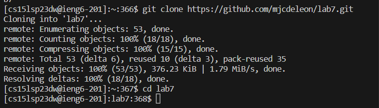
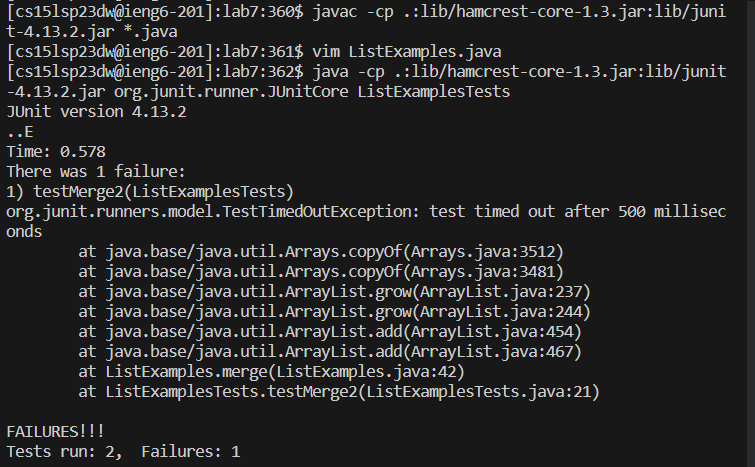
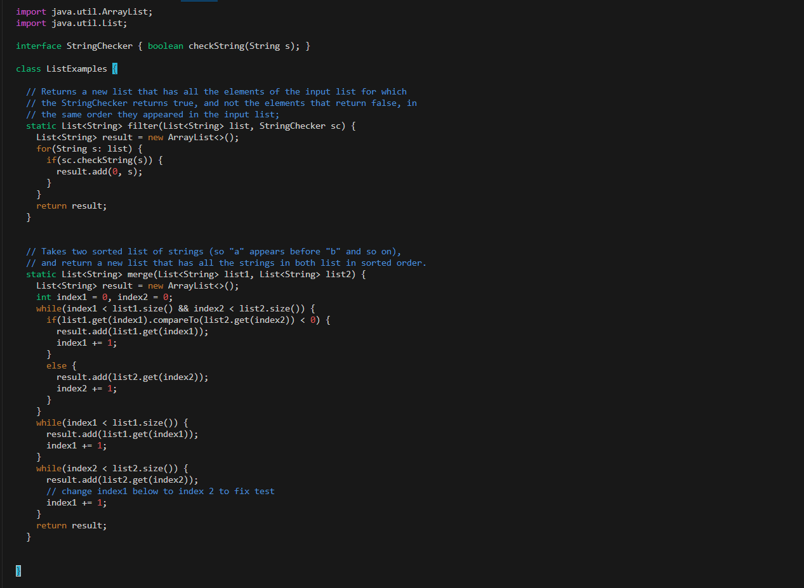
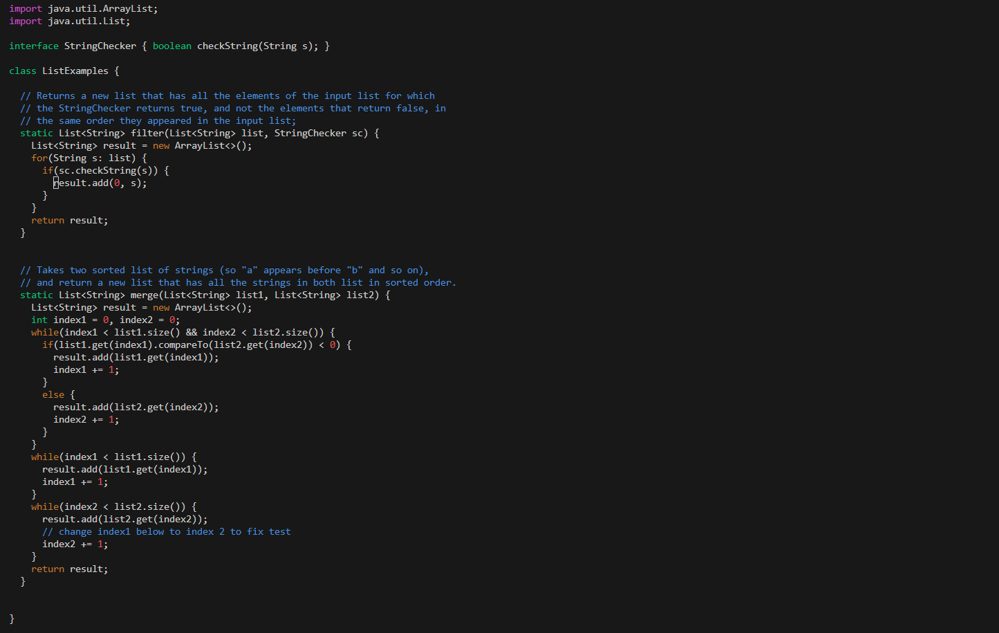

# Log into ieng6
   

Keys Pressed: `<up><up><enter>`  
I used 2 arrows up in the search history since the `ssh cs15lsp23dw@ieng6.ucsd.edu` command could be accessed that way.  

# Clone your fork of the repository from your Github account  
  

Keys Pressed: `<control> + <r>`, then type in 'git'  
then type 'git' The ` git clone https://github.com/mjcdeleon/lab7.git` command could be accessed this way since it was the first result of the reverse search. Then I did the `cd lab7` command, in order to change the directory so I would be able to access the ListExamples.java and the ListExamplesTests.java files.   

# Run the tests, demonstrating that they fail 
  

Keys Pressed: `<control> + <r>`, then type 'javac', this allowed me to access the `javac -cp .:lib/hamcrest-core-1.3.jar:lib/junit-4.13.2.jar *.java` command. After that I did `<control> + <r>`, then typed 'java -' which allowed me to access the `java -cp .:lib/hamcrest-core-1.3.jar:lib/junit-4.13.2.jar org.junit.runner.JUnitCore ListExamplesTests` command.  

# Edit the code file to fix the failing test  
## Before the fix
  

Keys Pressed: `<control> + <r>`, then type 'vim', I used this way in order to get the `vim ListExamples.java` command. Then in the ListExamples.java file I did `<up><up><up><up><up><up>` to reach the desired line that I would edit, `<right><right><right><right><right><right><right><right><right><right><right>` to reach the desired position/character that I would like to edit, `<x>` to delete the specific character, `<i>` so that I could insert a new character, this new character being 2, so the variable `index1` was now `index2` as displayed below:  

## After the fix

# Run the tests, demonstrating that they now succeed  
.png)

Here I had redone the same actions I had earlier when proving that the tests failed, however, here they now succeed. 
Keys Pressed: `<control> + <r>`, then type 'javac', this allowed me to access the `javac -cp .:lib/hamcrest-core-1.3.jar:lib/junit-4.13.2.jar *.java` command. After that I did `<control> + <r>`, then typed 'java -' which allowed me to access the `java -cp .:lib/hamcrest-core-1.3.jar:lib/junit-4.13.2.jar org.junit.runner.JUnitCore ListExamplesTests` command.  

