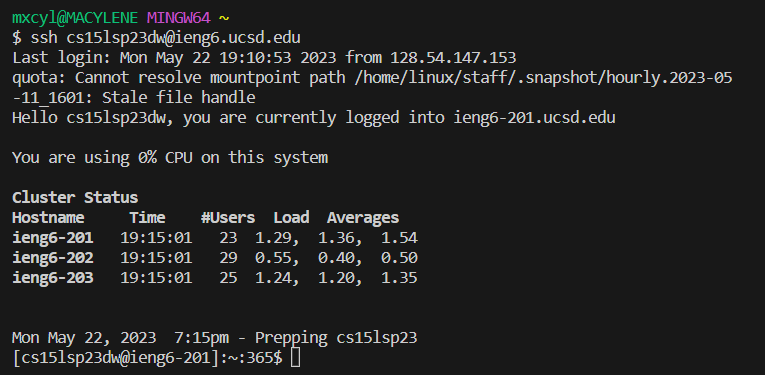

# Log into ieng6
  

Keys Pressed: `<up><up><enter>`  
I used 2 arrows up in the search history since the `ssh cs15lsp23dw@ieng6.ucsd.edu` command could be accessed that way.
  

# Clone your fork of the repository from your Github account  

Keys Pressed: `<control> + <r>`, then type in 'git'  
then type 'git' The ` git clone https://github.com/mjcdeleon/lab7.git` command could be accessed this way since it was the first result of the reverse search. Then I did the `cd lab7` command, in order to change the directory so I would be able to access the ListExamples.java and the ListExamplesTests.java files.  

# Run the tests, demonstrating that they fail 

`<control> + <r>`, then type 'javac', this allowed me to access the `javac -cp .:lib/hamcrest-core-1.3.jar:lib/junit-4.13.2.jar *.java` command. After that I did `<control> + <r>`, then typed 'java -' which allowed me to access the `java -cp .:lib/hamcrest-core-1.3.jar:lib/junit-4.13.2.jar org.junit.runner.JUnitCore ListExamplesTests` command.

# Edit the code file to fix the failing test  

vim ListExamples.java  
6 up 
11 right  
x key  
i key  
2  
changed the 1 to a 2  

Run the tests, demonstrating that they now succeed  
javac -cp .:lib/hamcrest-core-1.3.jar:lib/junit-4.13.2.jar *.java  
java -cp .:lib/hamcrest-core-1.3.jar:lib/junit-4.13.2.jar org.junit.runner.JUnitCore ListExamplesTests  
Now show screenshot

